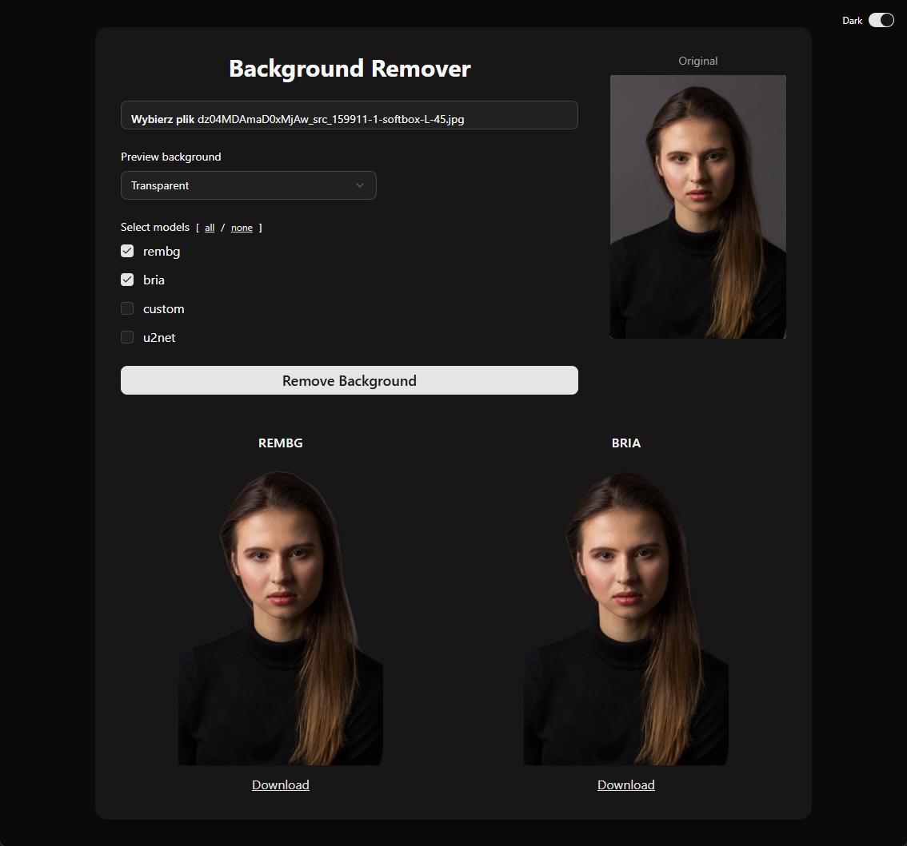

# Background Remover

A web application for removing backgrounds from images. 

The frontend is based on Next.js + React + shadcn/ui, and the backend is built with FastAPI (Python) supporting the rembg, bria, u2net and simple custom model.



## Prerequisites

- Python 3.9+ (Python 3.10 or newer recommended)
- Node.js 18+
- pnpm

## Installing dependencies and starting up

```bash
pnpm bootstrap
pnpm backend:start
pnpm frontend:dev
```

## pnpm scripts

- `pnpm bootstrap` — installs pnpm dependencies and Python dependencies in a virtualenv in the `server` folder

### Frontend
- `pnpm frontend:dev` — starts the Next.js frontend in development mode
- `pnpm frontend:build` — builds the frontend
- `pnpm frontend:start` — starts the built frontend in production mode
- `pnpm frontend:lint` — lints the frontend code

### Backend
- `pnpm backend:start` — starts the FastAPI backend (requires Python dependencies to be installed)
